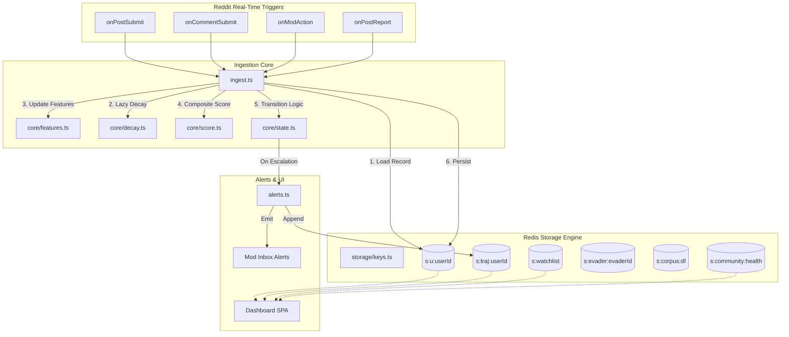

# Sentinel

<p align="center">
  
</p>
<p align="center">
  <strong>Behavioral Trajectory Analysis for Subreddit Moderation</strong><br />
  <em>Detecting escalating patterns before violations occur — server-side, zero-egress, high-performance.</em>
</p>

<p align="center">
  
  
  
  
  
</p>

---

## The Sentinel Paradigm: Trajectory, Not State

Most moderation tools react to isolated, static incidents. They flag a bad word or queue a reported post. **Sentinel is different.** It models a contributor’s *behavioral trajectory* over time across six distinct axes. By integrating incoming events into exponentially decayed moving averages, Sentinel distinguishes a historically excellent user going through a bad week from an account systematically escalating toward bad behavior.

By computing a composite score $S \in [0, 1]$ and mapping it to a highly resilient state machine, Sentinel surfaces the small fraction of users who are deteriorating *fastest*, giving moderator teams a proactive window to intervene before a major violation occurs.

---

## Core Algorithmic Pillars

### 1. The Six-Dimensional Behavioral Vector
Sentinel evaluates every contributor across six core features, each maintained as a bounded Exponential Moving Average (EMA) in $[0, 1]$ with an identical, mod-configurable half-life (default: 30 days):

$$\text{EMA}_t = \alpha \cdot x_t + (1 - \alpha) \cdot \text{EMA}_{t-1}$$

$$\alpha = 1 - 2^{-\frac{1}{\tau}}$$

Where $\tau$ is the half-life in days, and $x_t \in [0, 1]$ is the observation generated by the active event. Because all features are strictly bounded within $[0, 1]$, they are weight-summable into a single composite score without needing ad-hoc normalization at scoring time:

| Feature Axis | Operational Definition | Weight ($W_i$) |
|:---|:---|:---:|
| **Removal Rate ($R$)** | Ratio of moderator removals to total submissions. $x_t = 1$ on removal, $0$ on post/comment. | `0.30` |
| **Warning Response ($W$)** | Delta of the removal rate following a formal warning. Escalates if warnings are ignored. | `0.22` |
| **Controversy Affinity ($C$)** | Ratio of engagement on flagged threads versus overall participation. | `0.18` |
| **Activity Velocity ($V$)** | Rolling volume of daily submissions, normalized to prevent spam-bursts. | `0.12` |
| **Vocabulary Fingerprint ($F$)** | Cosine similarity of character n-gram frequencies against flagged patterns. | `0.12` |
| **Posting-Time Signature ($T$)** | Concentration ("tightness") of the contributor's active hour-of-day histogram. | `0.06` |
| **Total Composite Score ($S$)** | $\sum (F_i \cdot W_i)$ | **`1.00`** |

> [!NOTE]
> **Safety Invariant:** Feature weights are balanced so that *no single axis* can push a user past the `ELEVATED` threshold (0.45) on its own. For example, a high removal rate alone contributes at most `0.30`, ensuring multi-dimensional signal alignment is required for escalation.

### 2. Hysteretic State Machine
To prevent borderline users from oscillating rapidly ("thrashing") between states, Sentinel implements a hysteretic state machine. Escalation requires the candidate state to be sustained for a minimum dwell period; de-escalation requires a longer dwell period, encoding the core moderation principle that **restoring trust takes longer than losing it**.

```
    [ HEALTHY ] ──(Dwell: 3d)──> [ WATCHING ] ──(Dwell: 3d)──> [ ELEVATED ] ──(Dwell: 3d)──> [ CRITICAL ] ──(Dwell: 3d)──> [ BANNED ]
         ▲                            │                            │                            │
         └────────(Dwell: 7d)─────────┴────────(Dwell: 7d)─────────┴────────(Dwell: 7d)─────────┘
```

*   **Escalation Dwell:** 3 Days (above threshold)
*   **De-escalation Dwell:** 7 Days (below threshold)
*   **Sticky State:** The `BANNED` state is terminal and sticky. It can only be cleared by an explicit moderator action (e.g. unbanning).

### 3. Zero-Egress Ban Evader Fingerprinting
When a user is banned, Sentinel compiles a local, anonymized behavioral signature consisting of:
1.  **Temporal Histogram:** A 24-bin normalized density vector representing hourly posting distribution.
2.  **Vocabulary Profile:** A sparse vector of character n-grams (2-grams and 3-grams) normalized using a subreddit-wide Term Frequency-Inverse Document Frequency (TF-IDF) corpus.

When a newly registered account joins the subreddit, Sentinel tracks its early activity. Once it crosses `MIN_EVENTS_FOR_SCORING`, its signature is evaluated against the banned repository using weighted cosine similarity:

$$\text{Combined Similarity} = 0.4 \cdot \text{Similarity}_{\text{temporal}} + 0.6 \cdot \text{Similarity}_{\text{vocab}}$$

If the combined similarity exceeds `evaderSimilarity` (default: 0.78), a high-priority eviction alert is raised. **All matching is performed server-side without external API calls or storing PII.**

---

## Architectural Topology

Sentinel is built from the ground up to operate entirely inside the Reddit Devvit serverless sandbox. It has zero external dependencies, no HTTP egress (`permissions.http.enable: false`), and operates with strict local isolation.



---

## High-Performance Decay-on-Read Scaling

Traditional modeling tools require batch cron jobs to decay scores for all users at midnight, creating massive database traffic spikes. Sentinel solves this with **Decay-on-Read**:

*   Every user record stores its features along with a `lastEventAt` timestamp.
*   Whenever a user triggers a new event, Sentinel calculates the elapsed interval:
    $$\Delta t = \text{now} - \text{lastEventAt}$$
*   The stored feature values are lazily decayed up to the present instant *in memory* before the new event is applied.
*   **Performance Impact:** Redis compute and storage scale strictly with $O(\text{active users})$ rather than $O(\text{total population})$, maintaining a flat memory footprint and sub-millisecond query responses.
*   *Safety Net:* A lightweight scheduled job runs every 15 minutes to commit pending state transitions for users who have gone completely quiet, ensuring that escalation alerts are never missed.

---

## Subreddit Simulation Sandbox

Sentinel includes a high-fidelity **Simulation Sandbox** designed to let moderators test, calibrate, and witness proactive pathing in real-time. 

Instead of injecting dummy static records, the sandbox runs a chronological event generator that simulates 30 days of distinct user behaviors (e.g., highly collaborative regulars, accelerating spammers, warning-defying rule-breakers, and returning ban alts). These events are streamed sequentially through the production `ingest()` pipeline. 

This generates genuine historical trajectories, decaying curves, hysteretic state escalations, and ban-evader alerts that align perfectly with the core mathematical model.

---

## Repository Structure

```
├── public/                 # SPA static layouts
│   ├── splash.html         # Premium welcome and configuration portal
│   ├── dashboard.html      # Glassmorphic control and trajectory layout
│   └── styles.css          # Curated global design system and styling
├── src/
│   ├── shared/             # Dual-visible contract types and API paths
│   │   ├── api.ts          # Strictly typed request/response contracts
│   │   └── types.ts        # Shared domain types (Alerts, Health, Trajectory)
│   ├── client/             # Frontend Single Page Applications
│   │   ├── splash.ts       # Portal bootstrapping and interaction logic
│   │   ├── dashboard.ts    # Rich charts, attention tables, and settings UI
│   │   ├── charts.ts       # Bézier-path area charts & sparklines (Vanilla SVG)
│   │   └── format.ts       # Premium date, time, and score localized formatters
│   ├── server/             # Serverless backend runtime
│   │   ├── core/           # PURE algorithmic engines (mathematics only, no side-effects)
│   │   │   ├── decay.ts    # Bounded EMA calculations & temporal decay
│   │   │   ├── features.ts # Six-dimensional feature extraction & vectors
│   │   │   ├── score.ts    # Summation weighting & driver attributions
│   │   │   ├── state.ts    # Hysteretic escalation and dwell manager
│   │   │   ├── cosine.ts   # Scale-invariant cosine similarity
│   │   │   └── ngrams.ts   # Char n-gram tokenization and sanitization
│   │   ├── storage/        # Strongly typed Redis CRUD wrappers
│   │   │   ├── keys.ts     # Centralized key manager (prevents collisions)
│   │   │   ├── user.ts     # User metadata & vector reads/writes
│   │   │   ├── evaders.ts  # Evader fingerprint storage
│   │   │   ├── alerts.ts   # Deduped event logger
│   │   │   └── community.ts# Subreddit health aggregations & trends
│   │   ├── handlers/       # Server entry points and routing
│   │   │   ├── api/        # JSON API endpoints powering the dashboard
│   │   │   ├── jobs/       # Scheduler cron tasks (decay, drift, recompute)
│   │   │   ├── menu/       # Subreddit moderator context menu actions
│   │   │   └── triggers/   # Event handlers mapping Reddit actions
│   │   ├── ingest.ts       # Unified event ingestion chokepoint
│   │   ├── alerts.ts       # Dedup-aware notification engine
│   │   └── router.ts       # Route dispatcher and error boundaries
└── tools/
    └── build.ts            # High-speed dual-target esbuild pipeline
```

---

## CLI Operations Reference

Sentinel comes equipped with a comprehensive build and verification suite:

```bash
# Install development dependencies
npm install

# Perform static type checking and structural validation
npm run type-check

# Run the complete test suite (80+ automated unit & property-based tests)
npm test

# Build and compile client (minified ESM) and server (CommonJS) bundles
npm run build

# Boot the local Devvit sandboxed emulator
npm run dev

# Deploy the application to your subreddit
npm run deploy
```

---

## Configurable Moderation Thresholds

Sentinel exposes a rich set of fine-grained tuning knobs via Devvit's native Subreddit Settings panel, allowing you to align Sentinel's math with your community's unique culture:

| Setting Key | Default | Type | Operational Rationale |
|:---|:---:|:---:|:---|
| `decayWindowDays` | `30` | Integer | Half-life ($\tau$) of the EMA features in days. Controls historical memory. |
| `thresholdWatching` | `0.20` | Float | Lower bound of the `WATCHING` band. Highlights mild deviance. |
| `thresholdElevated` | `0.45` | Float | Lower bound of the `ELEVATED` band. Represents standard warning territory. |
| `thresholdCritical` | `0.70` | Float | Lower bound of the `CRITICAL` band. Indicates imminent danger of violation. |
| `escalateAfterDays` | `3` | Integer | Required dwell duration (in days) above threshold to promote state. |
| `deescalateAfterDays`| `7` | Integer | Required dwell duration (in days) below threshold to demote state. |
| `evaderSimilarity` | `0.78` | Float | Combined cosine similarity threshold for ban-evader matching. |
| `killSwitch` | `off` | Boolean | Disables ingestion and scoring globally without uninstalling. |
| `exemptList` | `[]` | Array | Specific accounts excluded from scoring (e.g. bots, moderators). |

---

## Privacy and Trust Guarantees

Sentinel has been engineered with strict **Privacy-by-Design** principles to ensure absolute compliance with user trust standards:

*   **No HTTP Egress:** The application is entirely self-contained. It is physically impossible for Sentinel to transmit data outside the Reddit ecosystem (`permissions.http.enable: false`).
*   **Zero Text Storage:** Raw post or comment bodies are **never** persisted to Redis. Text is processed in-memory to extract anonymous character-n-grams and is immediately discarded.
*   **No PII or IPs:** Sentinel does not access, store, or track IP addresses, browser fingerprints, or private user details. All behavior is modeled from public moderator-visible activity.
*   **Strict Security Isolation:** The dashboard and API are secured through Reddit's native admin-authentication layer, visible exclusively to active moderators of the subreddit.

---

## License

Sentinel is released under the commercial-grade **BSD 3-Clause License**. See `LICENSE` for details.
